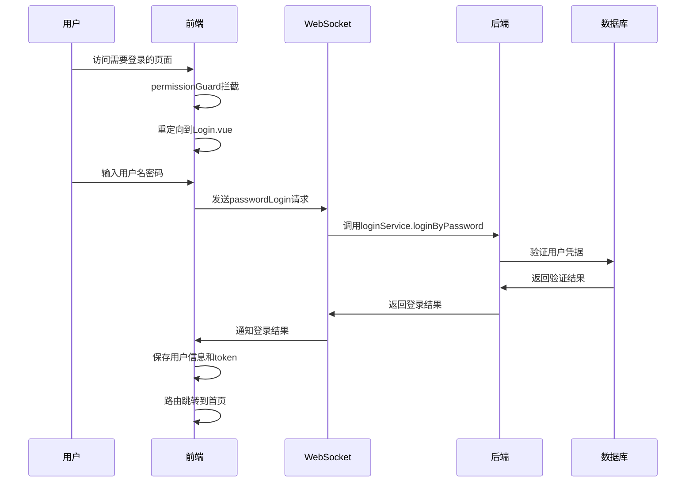

# 密码登录流程设计文档

## 1. 系统概述

本文档描述了从微信扫码登录改造为密码登录的完整流程。

## 2. 登录流程总览



## 3. 前端流程详解

### 3.1 路由与权限控制

```typescript
// 修改路由白名单，添加登录页面
const whiteList: Array<string | RegExp> = ['/', '/login']

// 添加登录路由
const LoginView = () => import('@/views/login_out/Login.vue')
const router = createRouter({
  routes: [
    {
      path: '/login',
      name: 'login',
      component: LoginView,
    },
    // 其他路由...
  ]
})

// 修改权限守卫
const createPermissionGuard = (router: Router) => {
  router.beforeEach(async (to, from, next) => {
    const userStore = useUserStore()
    const isSign = userStore.isSign

    if (whiteListTest(to.path) || isSign) {
      return next()
    } else {
      return next({ path: '/login', replace: true })
    }
  })
}
```

### 3.2 登录表单与验证

`Login.vue`实现了表单验证和登录请求发送：

```typescript
// 表单验证规则
const rules = reactive<FormRules<typeof ruleForm>>({
  username: [{ validator: checkUsername, trigger: 'blur' }],
  password: [{ validator: validatePass, trigger: 'blur' }]
})

// 登录处理
const submitForm = async (formEl: FormInstance | undefined) => {
  if (!formEl) return
  await formEl.validate(async (valid) => {
    if (valid) {
      wsIns.send({
        type: WsRequestMsgType.PASSWORD_LOGIN,
        data: {
          username: ruleForm.username,
          password: ruleForm.password
        }
      })
    }
  })
}
```

### 3.3 WebSocket消息类型

在`wsType.ts`中添加密码登录请求类型：

```typescript
export enum WsRequestMsgType {
  /** 1.请求登录二维码 */
  RequestLoginQrCode = 1,
  /** 2心跳检测 */
  HeartBeatDetection,
  /** 3用户认证 */
  Authorization,
  /** 4密码登录 */
  PASSWORD_LOGIN = 4,
}
```

## 4. 后端流程详解

### 4.1 WebSocket处理

在`NettyWebSocketServerHandler.java`中接收处理密码登录请求：

```java
@Override
protected void channelRead0(ChannelHandlerContext ctx, TextWebSocketFrame msg) {
    WSBaseReq wsBaseReq = JSONUtil.toBean(msg.text(), WSBaseReq.class);
    WSReqTypeEnum wsReqTypeEnum = WSReqTypeEnum.of(wsBaseReq.getType());
    switch (wsReqTypeEnum) {
        // 其他case...
        case PASSWORD_LOGIN:
            this.webSocketService.passwordLogin(ctx.channel(),
                  JSONUtil.toBean(wsBaseReq.getData().toString(), WSPasswordLoginReq.class));
            break;
    }
}
```

### 4.2 密码登录处理

`WebSocketServiceImpl.java`中的密码登录方法：

```java
public void passwordLogin(Channel channel, WSPasswordLoginReq wsPasswordLoginReq) {
    try {
        // 创建登录请求对象
        PwdLoginReq loginReq = new PwdLoginReq();
        loginReq.setUsername(wsPasswordLoginReq.getUsername());
        loginReq.setPassword(wsPasswordLoginReq.getPassword());

        try {
            // 调用登录服务验证用户名密码
            UserInfoResp userInfoResp = loginService.loginByPassword(loginReq);
            // 获取用户信息
            User user = userDao.getById(userInfoResp.getId());
            // 登录成功，更新状态
            loginSuccess(channel, user, userInfoResp.getToken());
        } catch (BusinessException e) {
            sendMsg(channel, WSBaseResp.build(1000, e.getMessage()));
        }
    } catch (Exception e) {
        log.error("密码登录异常", e);
        sendMsg(channel, WSBaseResp.build(1000, "系统异常，请稍后再试"));
    }
}
```

### 4.3 登录成功处理

登录成功后，`loginSuccess`方法更新用户状态：

```java
private void loginSuccess(Channel channel, User user, String token) {
    //更新上线列表
    online(channel, user.getId());
    //返回给用户登录成功
    boolean hasPower = iRoleService.hasPower(user.getId(), RoleEnum.CHAT_MANAGER);
    //发送给对应的用户
    sendMsg(channel, WSAdapter.buildLoginSuccessResp(user, token, hasPower));
    //发送用户上线事件
    boolean online = userCache.isOnline(user.getId());
    if (!online) {
        user.setLastOptTime(new Date());
        user.refreshIp(NettyUtil.getAttr(channel, NettyUtil.IP));
        applicationEventPublisher.publishEvent(new UserOnlineEvent(this, user));
    }
}
```

## 5. 关于HTTP登录接口的分析

目前系统同时支持两种密码登录方式：

### 5.1 WebSocket密码登录
```java
// WebSocketServiceImpl.java中
public void passwordLogin(Channel channel, WSPasswordLoginReq wsPasswordLoginReq) {
    // ...验证逻辑
}
```

### 5.2 HTTP REST密码登录
```java
// LoginController.java中
@PostMapping("/login/password")
@ApiOperation("密码登录")
public ApiResult<UserInfoResp> passwordLogin(@RequestBody @Valid PwdLoginReq req) {
    UserInfoResp userInfo = loginService.loginByPassword(req);
    return ApiResult.success(userInfo);
}
```
